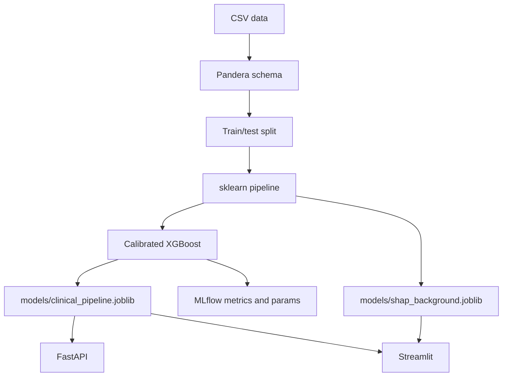

# Architecture

The project is organized around one idea: the same preprocessing code should be used during training and inference. For that reason, the model artifact is an sklearn pipeline rather than a standalone classifier.

## System Diagram

## Packages

| Path | Role |
| --- | --- |
| `config/` | Paths, feature names, constants, runtime settings |
| `src/data/` | Data generation, CSV loading, Pandera schema validation |
| `src/features/` | sklearn-compatible clinical feature transformers |
| `src/models/` | Model factory, pipeline builder, training script, API |
| `src/evaluation/` | Metrics, SHAP helpers, drift checks, benchmark script |
| `src/utils/` | Logging and sklearn output configuration |
| `tests/` | Regression tests for the highest-risk paths |

## Training Flow

1. Read the CSV and normalize column names.
2. Validate columns, types, and physiological ranges with Pandera.
3. Split data before fitting any transformer.
4. Fit imputation on the training split.
5. Fit clinical feature engineering on the training split.
6. Scale features after engineering.
7. Tune XGBoost with a seeded Optuna sampler.
8. Calibrate predicted probabilities with sigmoid calibration.
9. Save the full pipeline as `models/clinical_pipeline.joblib`.

## Why This Shape

The pipeline keeps feature code close to the model. That makes the API simpler and avoids copying transformation logic into the serving layer.

The feature engineer stores train-set statistics in `fit`. This is important because a patient prediction should not change depending on what other patients happen to be in the same request batch.

The API loads only from the local `models/` directory. `joblib` is convenient for sklearn, but it should not be treated as a safe format for untrusted files.

## Cross-Platform Notes

- Paths are built with `pathlib`.
- Main commands use `python -m ...`, which works on Windows and Linux.
- The Makefile is a convenience layer, not a requirement.
- Docker gives a Linux runtime, but Docker itself was not available in the local validation environment.

## Tradeoffs

- `joblib` is easy to use with sklearn but has the same trust issues as pickle.
- MLflow is configured for local tracking, not as a remote registry.
- The Streamlit app is useful for inspection, but it is not an operations dashboard.
- The dataset is synthetic. Architecture quality does not remove the need for external clinical validation.
