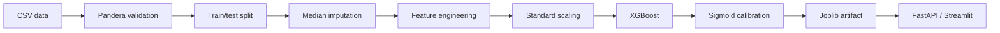
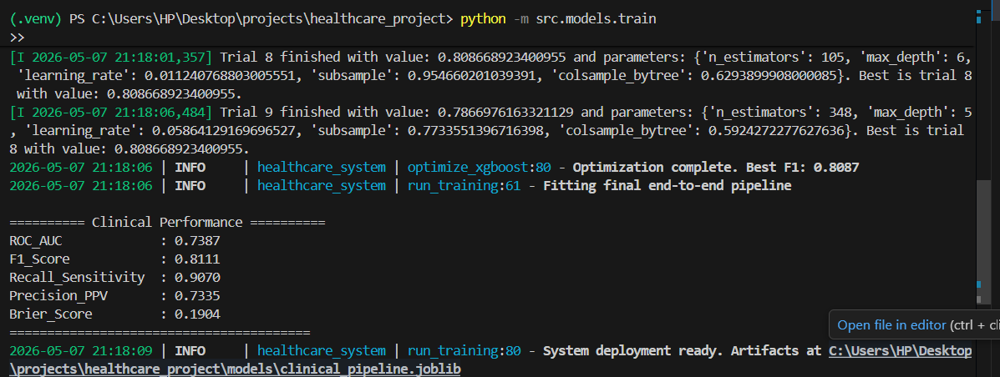
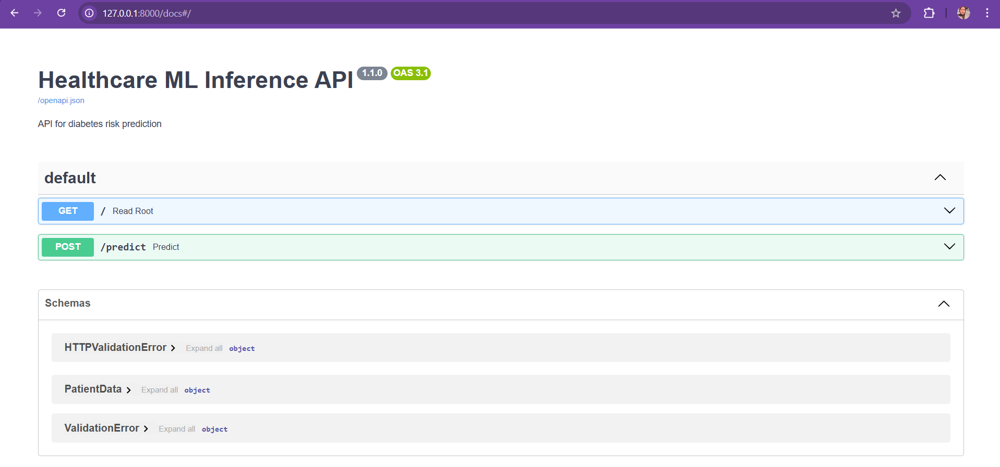
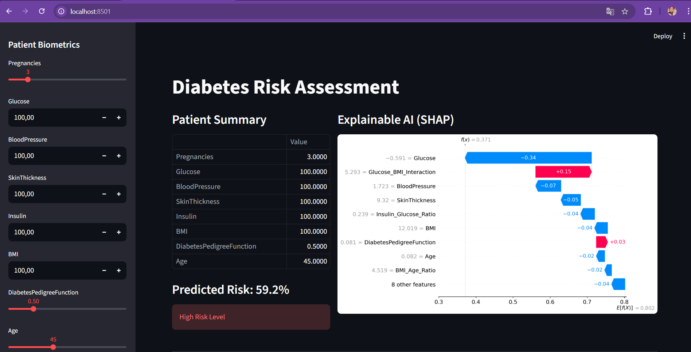
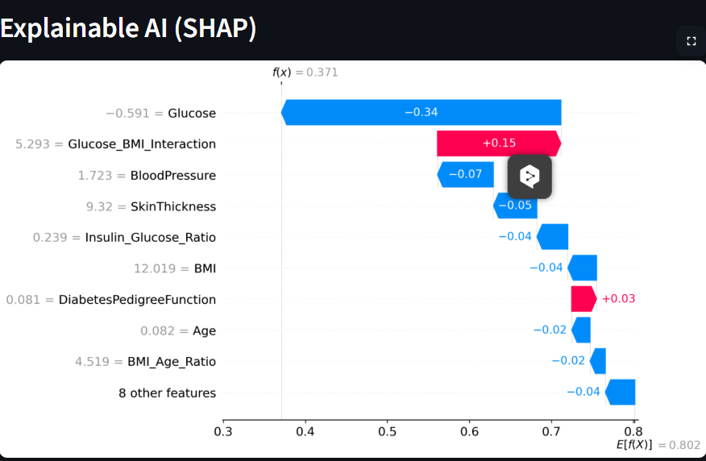
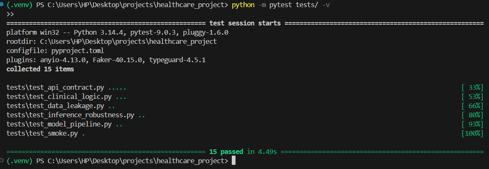
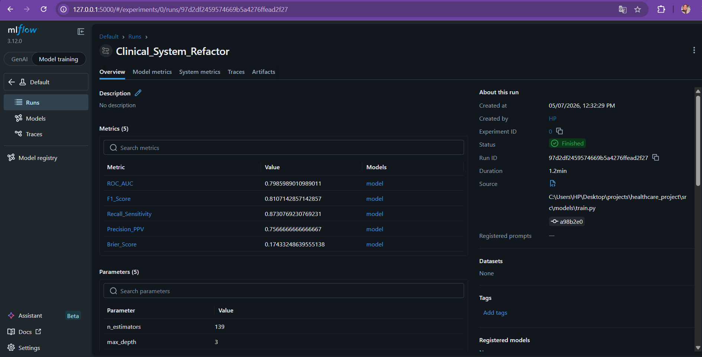

# Healthcare ML System: Diabetes Risk Prediction

Built by Ranim Rtimi as a machine learning and software engineering project focused on clinical risk modeling.

[](https://www.python.org/)
[](tests)
[](https://black.readthedocs.io/)
[](https://docs.astral.sh/ruff/)
[](https://mlflow.org/)

This project trains and serves a diabetes risk model from structured clinical inputs. The main goal is to show the engineering around the model: validation, leakage control, calibration, tests, API checks, Docker packaging, and clear documentation.

This is not medical software. The data is synthetic and Pima-like, so the results should be read as engineering evidence, not clinical evidence.

## What Is Included

- A single sklearn pipeline for imputation, feature engineering, scaling, and classification
- Calibrated XGBoost with seeded train/test split and seeded Optuna search
- Pandera schema checks for training data
- FastAPI endpoint with strict Pydantic input validation
- Streamlit UI for local inspection
- Pytest coverage for leakage, API validation, corrupted input, NaN inference, and smoke paths
- MLflow metrics/params logging and local `joblib` model persistence
- Dockerfile, Docker Compose, Makefile, Ruff, Black, isort, pre-commit, and GitHub Actions

## Current Results

| Item | Value |
| --- | --- |
| Tests | 15 passing |
| Model | XGBoost with sigmoid calibration |
| ROC-AUC | 0.7768 |
| F1 score | 0.8014 |
| Recall | 0.8692 |
| Brier score | 0.1804 |
| Single-row inference | 104.081 ms mean, 108.091 ms P95 |
| Training benchmark | 23.774 s with 1 Optuna trial |

Metrics come from the local synthetic dataset and should not be compared to clinical benchmarks.

## Repository Layout

```text
config/                  Paths and runtime settings
src/data/                Data generation, loading, schema validation
src/features/            Clinical feature engineering transformers
src/models/              Pipeline, model factory, training, API serving
src/evaluation/          Metrics, SHAP, drift checks, performance benchmarks
src/utils/               Logging and sklearn runtime setup
tests/                   Unit, smoke, API, corruption, inference tests
reports/                 Audits and model documentation
```

## Pipeline



## Design Choices

- **One sklearn artifact** keeps preprocessing and prediction together, which reduces training/serving drift.
- **Feature engineering fits on training data only**. The metabolic score stores train-set min/max values and does not recompute them from the inference batch.
- **API validation is intentionally strict**. Extra fields, booleans, non-finite values, and out-of-range clinical inputs are rejected.
- **`joblib` is treated as trusted input only**. The API only loads models from the local `models/` directory.
- **MLflow is used for local tracking**. The deployable artifact is still the local `joblib` file because it is simpler to move across environments.

## Clinical Limits

- The dataset is synthetic and not representative of real patient populations.
- The model has not been externally validated.
- SHAP output explains model behavior, not medical causality.
- Subgroup performance and calibration need more work before any serious clinical review.

## Setup

Windows:

```bash
python -m venv .venv
.venv\Scripts\activate
pip install -r requirements-dev.txt
python -m src.data.generator
python -m src.models.train
python -m pytest
```

Linux/macOS:

```bash
python -m venv .venv
source .venv/bin/activate
pip install -r requirements-dev.txt
python -m src.data.generator
python -m src.models.train
python -m pytest
```

## Common Commands

```bash
make train
make test
make lint
make app
make api
make benchmark
```

Direct commands work too:

```bash
streamlit run app.py
uvicorn src.models.api:app --host 0.0.0.0 --port 8000
docker compose up --build
```

## Documentation

- [Architecture](ARCHITECTURE.md)
- [Technical Audit](TECHNICAL_AUDIT.md)
- [Model Card](MODEL_CARD.md)
- [Deployment Guide](DEPLOYMENT_GUIDE.md)
- [Performance Audit](reports/performance_audit.md)
- [Security and Robustness Audit](reports/security_robustness_audit.md)

## Screenshots

### 1. Training Pipeline Industriel (MLOps & Optuna)


### 2. Interface Swagger API (Production-Ready)


### 3. Dashboard Complet (UI Streamlit)


### 4. Transparence Médicale (SHAP Explainable AI)


### 5. La Rigueur de l'Ingénieur (Tests Automatisés)


### 6. Le Tracking des Expériences (MLflow)

